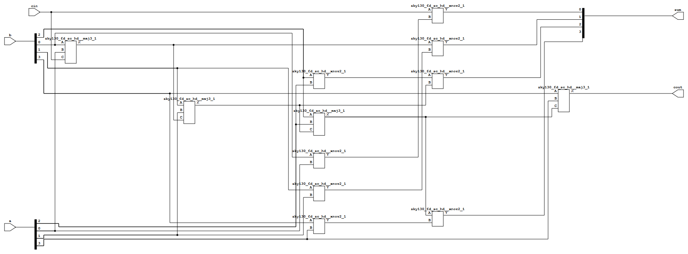
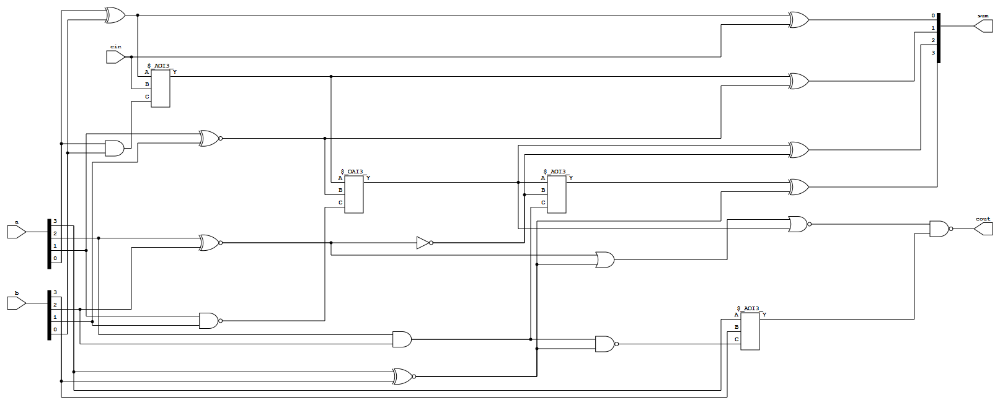
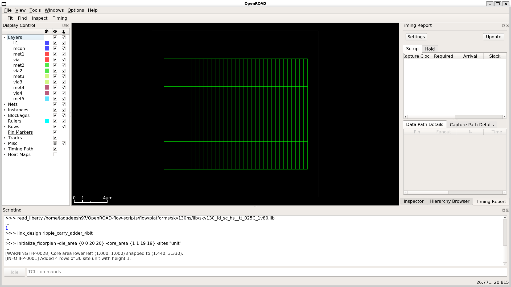
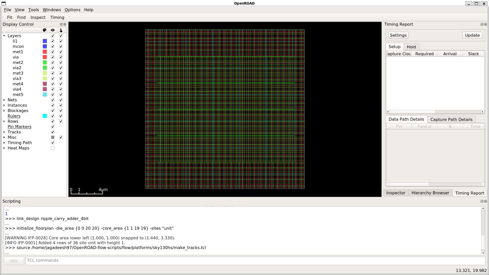
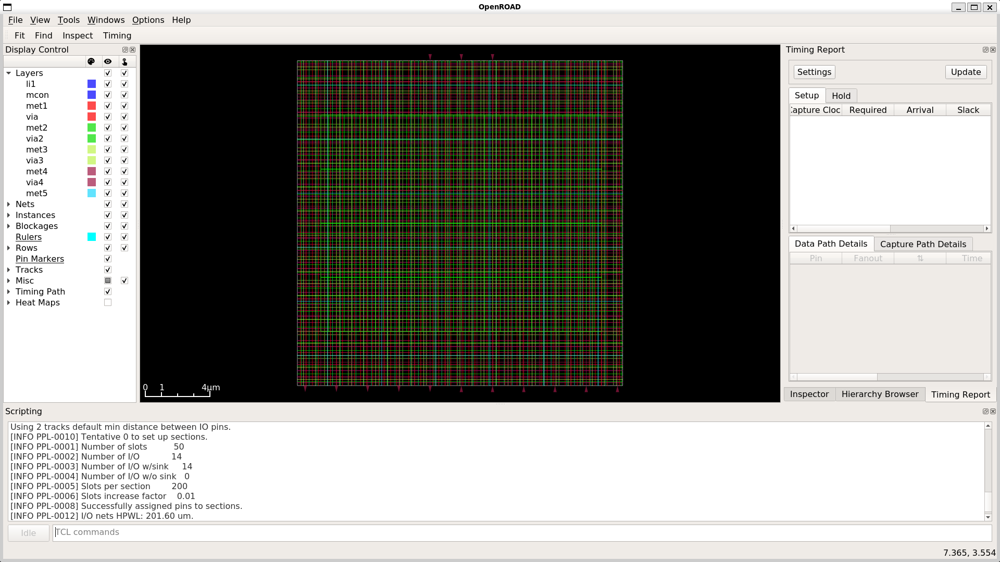
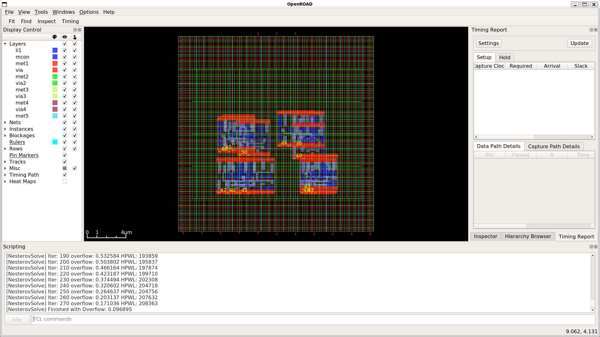
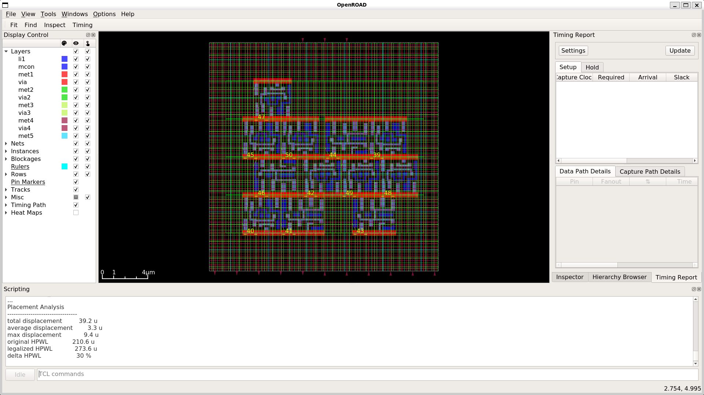
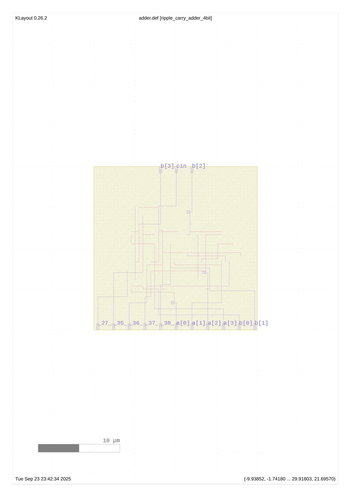

# Ripple Carry Adder 4-bit — OpenROAD Flow

This repository demonstrates synthesis, placement, and routing of a 4-bit ripple carry adder using the **OpenROAD** toolchain inside the OpenLane container environment. It includes generating schematics, PNGs, and layout files with a white background.

> Special Thanks to [Sanchit Kulkarni](https://www.linkedin.com/in/iamsanchitkulkarni/) Sir 
---

<p align="center">
  
</p>

```bash
convert \
  -delay 150 \
  floorplan.png \
  io_pins.png \
  global_placement.png \
  detailed_placement.png \
  routing.png \
  -loop 0 \
  flow.gif

```
## Schematics

| Schematic with Library | Schematic without Library |
|-----------------------|--------------------------|
|  |  |

---

## Floorplan & Placement Steps

| Step | Screenshot | Description |
|------|-----------|-------------|
| 1    |  | After initializing floorplan |
| 2    |  | After sourcing TCL file for routing tracks |
| 3    |  | After placing pins |
| 4    |  | Global placement of standard cells |
| 5    |  | Detailed placement of standard cells |
| 6    |  | Detailed routing of the design |
| 7    |  | Final layout in KLayout (adder.def) |


## Table of Contents

1. [Prerequisites](#prerequisites)
2. [Directory Setup](#directory-setup)
3. [Synthesis with Yosys](#synthesis-with-yosys)
4. [Visualizing the Netlist](#visualizing-the-netlist)
5. [Floorplanning and Placement with OpenROAD](#floorplanning-and-placement-with-openroad)
6. [Generating Layout](#generating-layout)
7. [Reports and Visualizations](#reports-and-visualizations)
8. [Tools and Terminology](#tools-and-terminology)
9. [PDK and Library Naming Conventions](#pdk-and-library-naming-conventions)

---

## Prerequisites

* **OpenLane container** (we use the container to manage dependencies)
* **Python 3.7+** (for SVG→PNG conversion)
* **CairoSVG** (`pip install cairosvg`)
* **Graphviz** (`dot` command)
* **KLayout** (for DEF/GDS visualization)

---

## Directory Setup

1. Start inside the OpenLane folder:

```bash
cd ~/OpenLane/
make mount
```

2. Navigate to your design source directory:

```bash
cd designs/ripple_carry_adder_4bit/src/
```

---

## Synthesis with Yosys

Open Yosys to synthesize the RTL design:

```bash
yosys
```

Then run the following commands:

```tcl
# Load standard cell library
read_liberty -lib /home/jagadeesh97/OpenROAD-flow-scripts/flow/platforms/sky130hs/lib/sky130_fd_sc_hs__tt_025C_1v80.lib

# Read RTL Verilog
read_verilog ripple_adder.v

# Synthesize top module
synth -top ripple_carry_adder_4bit

# Map D flip-flops to library cells
dfflibmap -liberty /home/jagadeesh97/OpenROAD-flow-scripts/flow/platforms/sky130hs/lib/sky130_fd_sc_hs__tt_025C_1v80.lib

# Technology mapping & optimization
abc -liberty /home/jagadeesh97/OpenROAD-flow-scripts/flow/platforms/sky130hs/lib/sky130_fd_sc_hs__tt_025C_1v80.lib

# Output mapped Verilog & JSON netlist
write_verilog ripple_adder_with_lib.v
write_json ripple_adder.json

exit
```

---

## Visualizing the Netlist

Generate an SVG schematic from the netlist:

```bash
netlistsvg ripple_adder.json -o ripple_adder_schematic.svg
```

Convert to PNG with white background:

```python
import cairosvg

cairosvg.svg2png(
    url="ripple_adder_schematic.svg",
    write_to="ripple_adder_schematic.png",
    background_color="white"
)

cairosvg.svg2png(
    url="ripple_carry_wo_lib.svg",
    write_to="ripple_carry_wo_lib.png",
    background_color="white"
)
```

---

## Floorplanning and Placement with OpenROAD

Start OpenROAD GUI:

```bash
openroad -gui
```

Then run the following TCL commands:

```tcl
read_verilog ripple_adder_with_lib.v

# Read technology LEF (layout exchange format)
read_lef /home/jagadeesh97/OpenROAD-flow-scripts/flow/platforms/sky130hs/lef/sky130_fd_sc_hs.tlef
read_lef /home/jagadeesh97/OpenROAD-flow-scripts/flow/platforms/sky130hs/lef/sky130_fd_sc_hs_merged.lef

# Load Liberty timing library
read_liberty /home/jagadeesh97/OpenROAD-flow-scripts/flow/platforms/sky130hs/lib/sky130_fd_sc_hs__tt_025C_1v80.lib

# Link synthesized netlist to layout
link_design ripple_carry_adder_4bit

# Initialize die & core area
initialize_floorplan -die_area {0 0 20 20} -core_area {1 1 19 19} -sites "unit"

# Generate routing tracks
source /home/jagadeesh97/OpenROAD-flow-scripts/flow/platforms/sky130hs/make_tracks.tcl

# Place IO pins
place_pins -hor_layers 6 -ver_layers 8

# Place standard cells
global_placement -density 0.9
detailed_placement

# Route signals
# global route
detailed_route

# Export DEF (Design Exchange Format) layout
write_def adder.def

exit
```

---

## Reports and Visualizations

Generate detailed Yosys reports and PNG images:

```bash
mkdir -p yosys-reports/
yosys synth.ys
dot -Tpng yosys-reports/ripple_adder_rtl.dot -o yosys-reports/ripple_adder_rtl.png
dot -Tpng yosys-reports/ripple_adder_hierarchy.dot -o yosys-reports/ripple_adder_hierarchy.png
dot -Tpng yosys-reports/ripple_adder_flat_netlist.dot -o yosys-reports/ripple_adder_flat_netlist.png
dot -Tpng yosys-reports/module_ripple_adder.dot -o yosys-reports/module_ripple_adder.png
```

Visualize layout in KLayout:

```bash
klayout adder.def
```

---

## Tools and Terminology

* **Yosys** — RTL synthesis tool for converting Verilog to gate-level netlist.
* **ABC** — Logic synthesis and optimization engine used inside Yosys.
* **OpenROAD** — Automated place & route tool for digital designs.
* **OpenLane** — Flow scripts and container environment integrating Yosys, OpenROAD, Magic, KLayout, etc.
* **KLayout** — Layout viewer & editor, useful for DEF/GDS visualization.
* **NetlistSVG** — Converts JSON netlists to visual schematics.

---

## PDK and Library Naming Conventions

* **PDK (Process Design Kit)** — Technology files provided by foundry (e.g., SkyWater 130nm). Includes LEF, LIB, GDS, etc.
* **LEF (Library Exchange Format)** — Physical cell shapes & site info.
* **TLIB/TLEF** — Technology LEF for the process, includes standard cells.
* **LIB (Liberty)** — Timing library describing delays, setup/hold times, etc.
* **tmp/lib/op\_XXX** — Temporary or optimized libraries generated by tools. Often:

  * `tmp` → intermediate netlists
  * `op` → optimized library variant
* **DEF (Design Exchange Format)** — Layout file representing placement & routing for tools like KLayout.

---

### Summary

This workflow demonstrates the **full VLSI digital flow**:

**RTL → Synthesized Gate-Level Netlist → Floorplan → Placement → Routing → Layout Visualization**, all inside the OpenLane container using OpenROAD tools. The output includes both **schematic PNGs** and **layout DEF** files.
